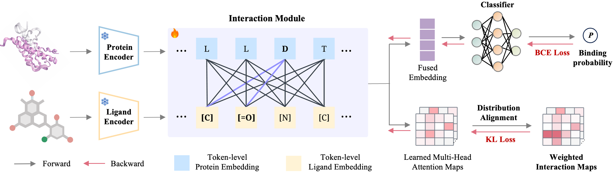

<table>
  <tr>
    <td width="120" valign="middle">
      
    </td>
    <td valign="middle">
      <h1>
        Determinantes físico-químicos explicables de la unión proteína–ligando mediante interacciones no covalentes
      </h1>
    </td>
  </tr>
</table>


<div align="center">

<!-- ───── ExplainBind Two-line Rotating Typing Animation (Blue Q, Orange A) ───── -->
<div align="center" style="display:flex; flex-direction:column; align-items:center; gap:8px;">

  <!-- Question line (Blue) -->
  <a href="https://readme-typing-svg.vercel.app">
    
  </a>

  <!-- Answer line (Orange) -->
  <a href="https://readme-typing-svg.vercel.app">
    
  </a>

</div>

<!-- ───── Project Badges ───── -->
[](https://zhaohanm.github.io/ExplainBind/)
[](https://doi.org/10.64898/2026.03.03.707476)
[](https://huggingface.co/spaces/Zhaohan-Meng/ExplainBind)
[](https://github.com/ZhaohanM/ExplainBind/blob/main/LICENSE)
[](https://visitorbadge.io/status?path=https%3A%2F%2Fgithub.com%2FZhaohanM%2FExplainBind)

</div>

## 🔥 Novedades
<!-- - **[Feb 2026]** 🧩 Introduce **InteractBind** with residue–atom ground-truth interaction maps. -->
- **[Marzo 2026]** ⛳ Nuestro preprint ahora está disponible en [biorXiv](https://doi.org/10.64898/2026.03.03.707476).
- **[Febrero 2026]** 🚀 ¡La interfaz demo de ExplainBind ya está disponible en [Hugging Face Spaces](https://huggingface.co/spaces/Zhaohan-Meng/ExplainBind)!

## 🧩 Descripción General

**ExplainBind** es un framework consciente de las interacciones para la predicción de la **unión proteína–ligando (PLB)**.  
Supervisa la atención cruzada a nivel de token utilizando **mapas de interacciones no covalentes** (por ejemplo, puentes de hidrógeno, puentes salinos, contactos hidrofóbicos, van der Waals, π–π e interacciones catión–π) derivados de complejos proteína–ligando curados del **PDB** en **InteractBind**.  
Al alinear la atención del modelo con estas señales con base física, ExplainBind transforma la predicción de PLB de un razonamiento de caja negra a un proceso **basado en la química**, adecuado para el cribado a gran escala.

<details open>
<summary>Framework ExplainBind</summary>



</details>

## 📖 Contenido
- [⚙️ Instalación](#️-installation)
- [⚡ Inicio Rápido](#-quick-start)
- [🔬 Modelos Fundamentales](#-foundation-models)
- [🧫 Conjunto de Datos](#️-dataset)
- [📝 Cita](#-citation)
- [🧰 Uso Previsto](#-intended-use)

## ⚙️ Instalación
> [!TIP] 
> Clona este repositorio de GitHub y configura un nuevo entorno de conda.

```
# create a new conda environment
$ conda create --name ExplainBind python=3.9
$ conda activate ExplainBind

# install requried python dependencies
$ pip install -r requirements.txt

# clone the source code of ExplainBind
$ git https://github.com/ZhaohanM/ExplainBind.git
$ cd ExplainBind
```
> Requisitos: Python ≥ 3.9 y una GPU compatible con CUDA.

## ⚡ Inicio Rápido

### Inferencia por Línea de Comandos
```bash
bash run.sh
```

## 🔬 Modelos Fundamentales

### 🧬 Modelos Fundamentales de Proteínas

| Nombre del Modelo | Enlace HuggingFace | Tipo de Entrada |
|-------------------|--------------------|-----------------|
| ESM2 | [facebook/esm2_t33_650M_UR50D](https://huggingface.co/facebook/esm2_t33_650M_UR50D) | Secuencia de Aminoácidos |
| SaProt | [westlake-repl/SaProt_650M_AF2](https://huggingface.co/westlake-repl/SaProt_650M_AF2) | Secuencia Consciente de la Estructura |
| SaProt | [westlake-repl/SaProt_650M_PDB](https://huggingface.co/westlake-repl/SaProt_650M_PDB) | Secuencia consciente de la estructura |

### 💊 Modelos Fundamentales de Moléculas

| Nombre del Modelo | Enlace HuggingFace | Tipo de Entrada |
|-------------------|--------------------|-----------------|
| MoLFormer-XL | [ibm-research/MoLFormer-XL-both-10pct](https://huggingface.co/ibm-research/MoLFormer-XL-both-10pct) | SMILES |
| SELFormer | [HUBioDataLab/SELFormer](https://huggingface.co/HUBioDataLab/SELFormer) | SELFIES |
| SELFIES-TED | [ibm-research/materials.selfies-ted](https://huggingface.co/ibm-research/materials.selfies-ted) | SELFIES |

> [!NOTE]  
> Todos los modelos fundamentales permanecen congelados. ExplainBind entrena el Módulo de Fusión utilizando supervisión de mapas de atención derivados de la estructura y el Clasificador.

## 🧫 Conjunto de Datos

Proporcionamos **9 puntos de referencia** con mapas de interacción realesreales (ground-truth) a nivel de residuos para la evaluación de la predicción de PLI. ¡Se lanzará pronto!

| Conjunto de Datos | Tipo | Uso de Ejemplo |
|-------------------|------|----------------|
| InteractBind (afinidad) | Divisiones por puntuación de afinidad | Evaluar dentro del dominio |
| InteractBind-P-25%/28%/31%/33% | Divisiones por similitud proteica | Evaluar la generalización a nivel de secuencia |
| InteractBind-L-08%/35%/40%/59% | Divisiones por similitud de ligando | Evaluar la generalización a nivel de secuencia |


<!-- ## 📝 Citation
```bibtex
@inproceedings{meng2026ExplainBind,
  title={ExplainBind: Explainable Protein–Ligand Binding via Non-Covalent Interaction Supervision},
  author={Meng, Zhaohan and Bai, Zhen and William, Oldham and Ounis, Iadh and Yuan, Ke and Meng, Zaiqiao and Xu, Hao and Joseph, Loscalzo},
  booktitle={BioArxiv},
  year={2026}
}
``` -->

## 📚 Agradecimientos

Este trabajo fue parcialmenteparcialmente financiado por las subvenciones HL155107 y HL166137 de los Institutos Nacionales de Salud (NIH), y por la beca MERIT AHA1185447 de la Asociación Americanael Corazón de EE. UU. a J.L.
K.Y. reconoce el apoyo de Cancer Research UK (EDDPGM-Nov21/100001, DRCMDP-Nov23/100010 y financiación principal para el Instituto de CRUK Escocia (A31287)), BBSRC BB/V016067/1, Prostate Cancer UK MA-TIA22-001 y la subvención del programa Horizonte 2020 de la UE ID: 101016851.

---

## 📜 Licencia

Este proyecto está licenciado bajo la **Licencia MIT** — consulta el archivo [LICENSE](LICENSE) para más detalles.

---

## 🧰 Uso Previsto

**ExplainBind** está diseñado para ayudar a **biólogos computacionales**, **investigadores de IA** y **científicos del descubrimiento de fármacos** a analizar y explicar las interacciones moleculares.

### Aplicaciones

- 🔬 **Descubrimiento de Fármacos** — Identificar huellas de unión explicables entre compuestos y proteínas.  
- 🧠 **Explicabilidad del Modelo** — Cuantificar la base biológica a nivel de token mediante la supervisión de mapas de atención.  
- 🧪 **Generalización entre Dominios** — Diagnosticar caídas en las predicciones a través de estratos de similitud proteica.  

> [!IMPORTANT]  
> Este framework está destinado **únicamente para fines de investigación** y no debe utilizarse para la toma de decisiones clínicas.
